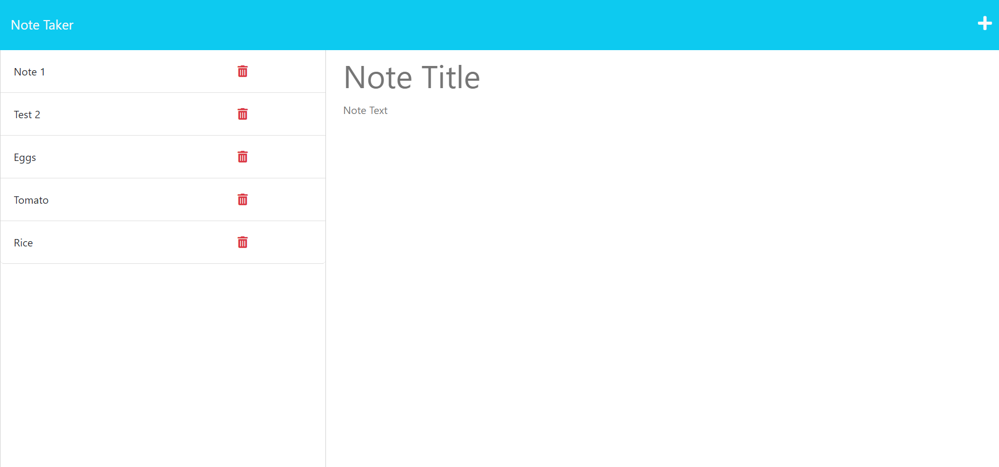

# Note Taker Application - John Zigterman

## Description

- I created an express.js backend for this note taking application.
- I set up a comprehensive file structure and set of paths for api requests.
- These allow the user to add a note that will be saved in a db.json file as part of a stringified array.
- This project uses express, uuid, and a custom version of clog.
- The user interface is a web page that can be accessed in a browser.

## Installation

This application can be accessed in a browser by either locally hosting it on one's own computer or accessing it through a hosting service like heroku.

## Usage

The user simply enters text into the provided fields and saves their note when they feel it is finished. The note can be called back up by clicking on its name in the left hand bar, and deleted by clicking the red trash can icon next to the note.

## Credits

I, John Paul Zigterman, completed this project by myself with the aid of the resources provided to me by the MSU coding bootcamp.

## Link

https://github.com/JohnPaulZigterman/note-taker 

## Screenshot

## License

MIT License

Copyright (c) 2023 John Paul Zigterman

Permission is hereby granted, free of charge, to any person obtaining a copy
of this software and associated documentation files (the "Software"), to deal
in the Software without restriction, including without limitation the rights
to use, copy, modify, merge, publish, distribute, sublicense, and/or sell
copies of the Software, and to permit persons to whom the Software is
furnished to do so, subject to the following conditions:

The above copyright notice and this permission notice shall be included in all
copies or substantial portions of the Software.

THE SOFTWARE IS PROVIDED "AS IS", WITHOUT WARRANTY OF ANY KIND, EXPRESS OR
IMPLIED, INCLUDING BUT NOT LIMITED TO THE WARRANTIES OF MERCHANTABILITY,
FITNESS FOR A PARTICULAR PURPOSE AND NONINFRINGEMENT. IN NO EVENT SHALL THE
AUTHORS OR COPYRIGHT HOLDERS BE LIABLE FOR ANY CLAIM, DAMAGES OR OTHER
LIABILITY, WHETHER IN AN ACTION OF CONTRACT, TORT OR OTHERWISE, ARISING FROM,
OUT OF OR IN CONNECTION WITH THE SOFTWARE OR THE USE OR OTHER DEALINGS IN THE
SOFTWARE.